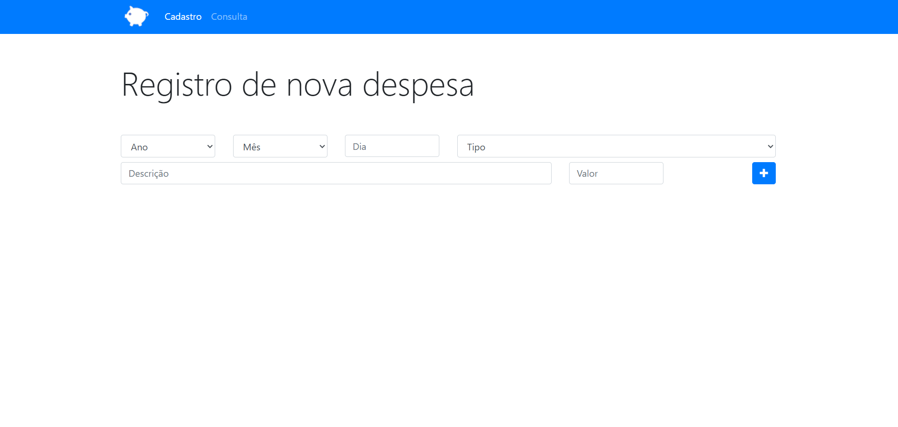
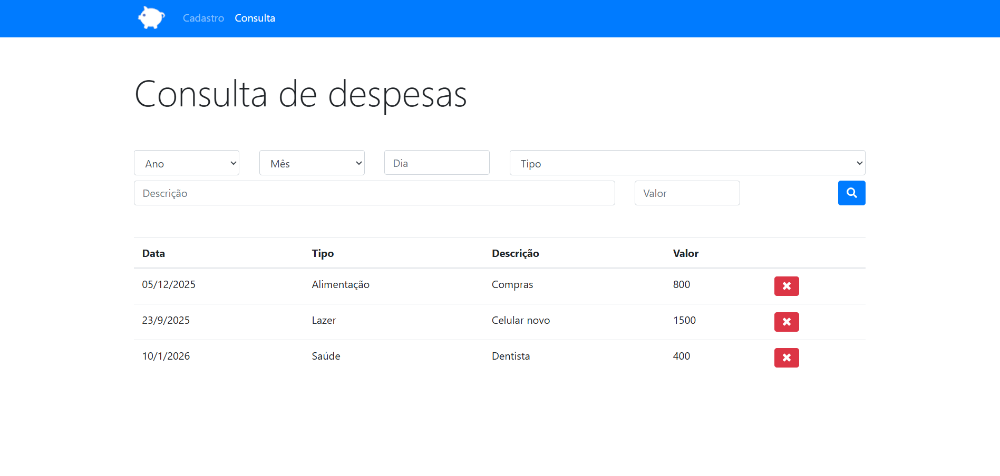

# 💰 App Orçamento Pessoal

> Um aplicativo web para controle financeiro pessoal, permitindo o cadastro, consulta e gerenciamento de despesas do dia a dia. Desenvolvido para colocar em prática conceitos de Orientação a Objetos no JavaScript e manipulação do DOM.

---

## 📸 Demonstração

  
  

---

## 🚀 Tecnologias Utilizadas

Este projeto foi desenvolvido utilizando as seguintes tecnologias:

- **[HTML5](https://developer.mozilla.org/pt-BR/docs/Web/HTML)**
- **[CSS3](https://developer.mozilla.org/pt-BR/docs/Web/CSS)**
- **[Bootstrap](https://getbootstrap.com/)**
- **[JavaScript (ES6+)](https://developer.mozilla.org/pt-BR/docs/Web/JavaScript):** Lógica da aplicação utilizando **Programação Orientada a Objetos (Classes)**.
- **LocalStorage:** Banco de dados do navegador para persistir os dados mesmo recarregando a página.

---

## ⚙️ Funcionalidades

O sistema possui as seguintes funções:

- ✔️ **Cadastrar Despesa:** Registro de data, tipo (Alimentação, Lazer, etc.), descrição e valor.
- ✔️ **Validação de Dados:** Impede o cadastro se houver campos em branco, exibindo um Modal de alerta.
- ✔️ **Listagem:** Exibe todas as despesas salvas de forma organizada.
- ✔️ **Filtro Avançado:** Permite pesquisar despesas por dia, mês, ano, tipo ou valor específico.
- ✔️ **Exclusão:** Botão para remover despesas individuais do banco de dados.

---

## 📂 Como rodar o projeto

**Clone o repositório:**

git clone https://github.com/GuilhermeCalixto1/app-orcamento-pessoal.git

Abra a pasta e inicie a página index.html

## 👨‍💻 Autor

 

<h3>Guilherme Calixto</h3> 
Estudante de Engenharia de Software

